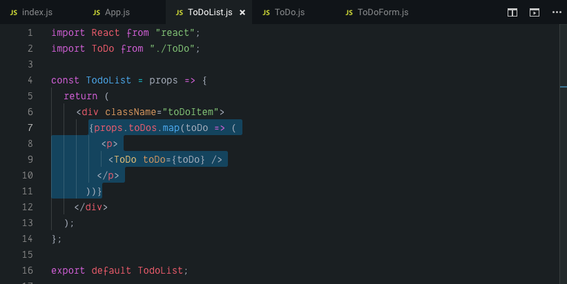
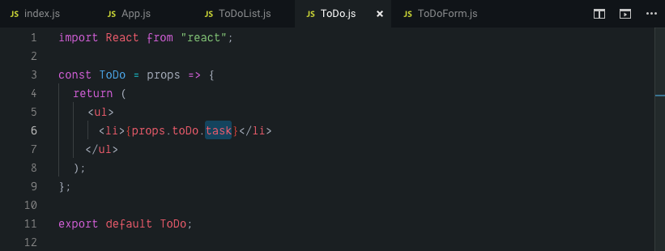
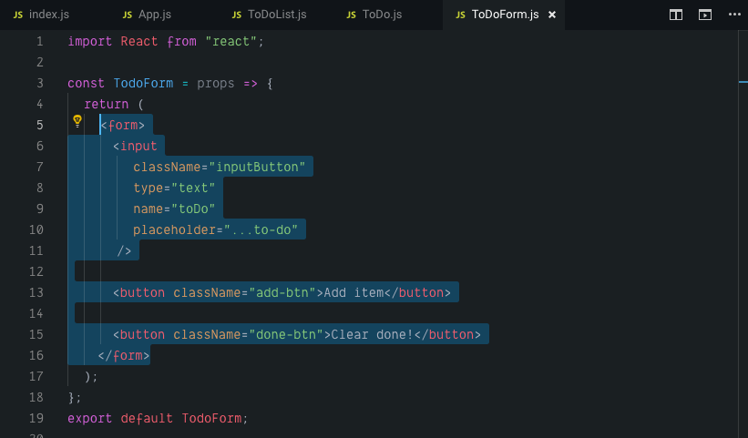
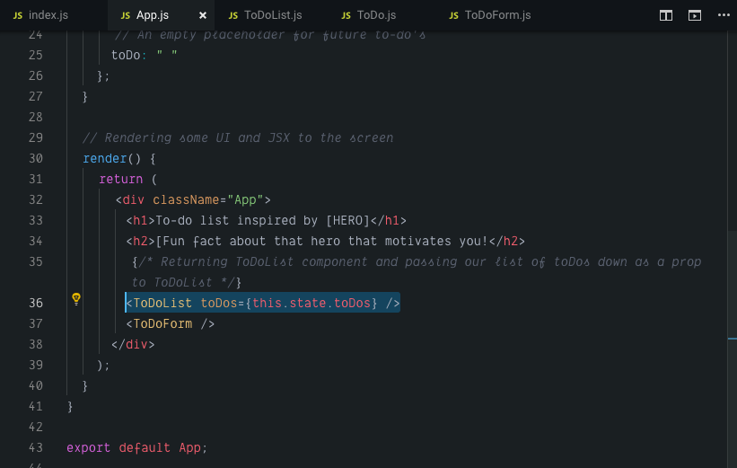
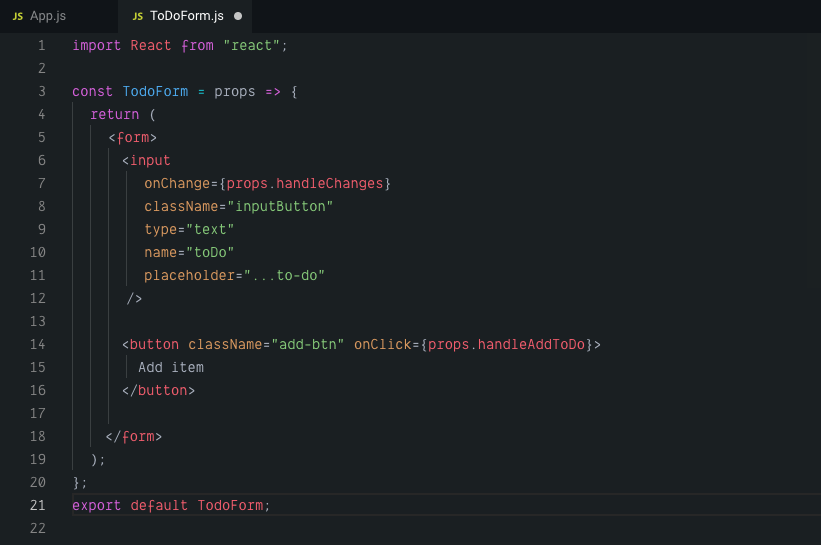
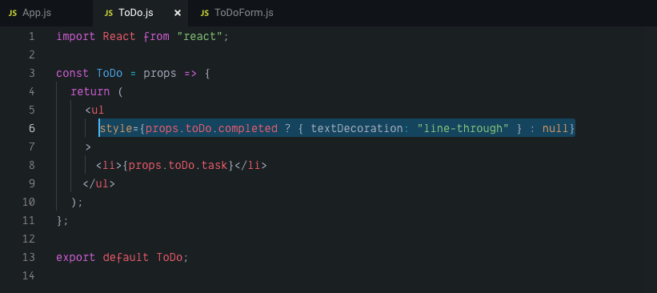
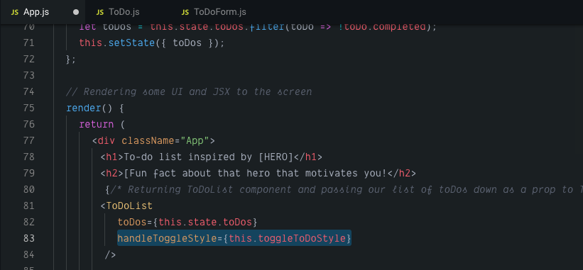
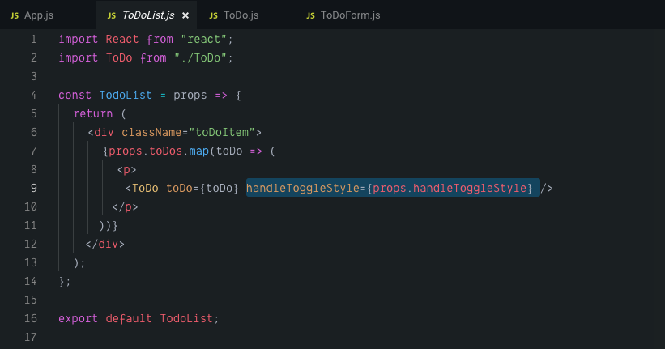

### _This post will walk you through how to build a basic to-do list app, covering React basics like: setting state and handling props, building and routing Components, and using the axios library to create, read, update and delete data._ 

If you start going through programming tutorials, you’ll likely notice a few recurring themes: Star Wars, Avengers, Lord of the Rings, rinse, repeat. 

To be clear: I don’t think that’s a bad thing! I think learning a complicated idea when it’s wrapped up in something a student loves makes said learning a whole lot easier. That's why I do it myself. I styled my [to-do list](https://twitter.com/kimeejohnson/status/1122155953397256193) learning exercise in honor of Dolly Parton, one of my inspirations. After that I turned an Instagram Clone into [Dollygram](https://dollygram.netlify.com/), and even changed employee names in another project's dataset to the characters from [9 to 5](https://www.youtube.com/watch?v=PVKTZ4CEM90). 

With that in mind, I tried something different to recap the past few weeks. I wrote a beginner React tutorial that teaches a student how to build a to-do list, and encourages them to pick someone who inspires them to theme it. It should only take a few extra minutes to brainstorm a theme first, but planning that unique piece of individuality can help make a student (read: it helps make me) more invested. As Dolly says, "You gotta keep trying to find your niche and trying to fit into whatever slot that's left for you or to make one of your own."

Read on for the full tutorial! In the meantime, I’ll be reviewing more React basics including tooling and composition patterns, and learning Redux.

    

## Build a basic to-do list with React 

### Vocab words   

Before getting started with your to-do list, you need to first pick an inspiration for your theme, and then get to know these four vocab words: React, Components, state, and props. 

[**React**](https://reactjs.org/docs/getting-started.html) is a user interface library that Facebook built to solve their particular problem of dealing with a lot of data all at once. 

For example, head over to your inspiration’s Facebook page. I’m looking at [Dolly’s](https://www.facebook.com/DollyParton/). What happens when you like a post? What about when you click on the number of comments on that post? Like a comment? Add a comment yourself?  

These actions are called “user interactions.” Each time one happens, the information on the "user interface" (UI), your screen, changes: the comments unfold; the number of likes increases; the number of comments increases. 

React makes that magic possible through the use of **Components**, parts that can be reused throughout the page. After we write the recipe for a Component like a container for a Facebook post, we can call the Component multiple times to show multiple posts with different data on a page. Think of it like an architect's blueprint. Once an architect writes a blueprint floorplan for a 2-bedroom apartment, she can repeat the blueprint and insert the floorplan throughout a building any number of times. The future residents (data) will still make each bedroom unique.   

In a React app, Components live in their own “/components” folder. In our project, we will import them into a main App.js file, which is where we’ll be storing all of our app’s data, also known as its **state**. 

There will be times when we need to pass that data, the state, down from the top of the App to our different Components. We’ll do that through **props**. If our App is a storehouse, then the State is the different packages in the storehouse, and props are the delivery trucks that carry the packages to wherever they need to go. 

Once you have this vocab down, you’re ready to head over to CodeSandbox, fork this [starter project](https://codesandbox.io/embed/l7nkwojlvq), and follow along. 

### Tutorial 

Glance over the file structure. Notice our index.js and App.js files at the root of the project. Click into index.js and you’ll see all it’s doing is returning <App />, our App component, to the screen. We’ll build out the parts <App /> displays in App.js. Head over to that file and look at what it returns. Swap out the placeholders and notice how the display updates. 

That’s neat. But, we don’t want <App />  to _just_ display our text. We also want it to show complex, dynamic data. Our to-do list will show a list of all the items we have yet to do, and also let us add new tasks, cross-off finished ones, and clear the cross-outs when we’re done. Empty placeholders for building all of those Components live in /components/ToDoComponents. There you should see the files: ToDoList.js, ToDo.js, ToDoForm.js, and ToDo.css. 

Now that we’ve got our file structure down, let’s map out the four things we need to accomplish to get our list working: 1) Display the list of tasks, 2) Add new items to the list, 3) Cross-off completed tasks, 4) Clear out what we’ve finished. 

#### 1. Display the list of tasks

Start in App.js. The code `class App extends React.Component` kicks our Component off. We set it up as a class because we want <App /> to hold **state**, our app’s data, which as of now is an array called “toDos” that contains unique “toDo” objects. Each “toDo” holds a task, an id, and a boolean. Replace the placeholder data with some of your own tasks, or things your hero might want you to do (Dolly definitely wants me to be practicing my mandolin). 

In order to get our tasks stored in **state** to display, we’ll need to pass it down to our ToDoList component in the form of a prop. To do that, we first have to import ToDoList at the top of our file: 

And then make sure App returns <ToDoList /> to the screen. Once we’ve done that, we can pass our state down through `<ToDoList />`. 

Right now that’s not actually doing anything because ToDoList.js is empty. Derp. Let’s go build out `<ToDoList />`, making sure the file starts just like App.js by importing React `import React from “react.js”`. 

Since we know that `<App />` holds our state, we can set up `<ToDoList />` as a simpler functional component. But still not too simple: we don’t want to display our `props.todos` passed down from state in their raw form here, but instead would rather pass each unique task down to a unique `<ToDo />` component for easier management and styling. We can do that by using the array method [.map](https://developer.mozilla.org/en-US/docs/Web/JavaScript/Reference/Global_Objects/Array/map) over `props.toDos`. 

 

Just like we imported ToDoList in App.js, we’ll now need to import ToDo at the top of ToDoList.js. And, once you’ve done that, we’ll have to create `<ToDo />` in ToDo.js. 

We’ll import React at the top and setup `<ToDo/>`  as another functional component. Let’s think about all the props we just passed down. Each toDo made from `todos.map` has a task, an id, and a completed value. Since we only need the task to display in our list, we can specifically call that out by adding `.task` to our prop. 

 

With your first placeholder task(s) displaying on the screen, we’re good to learn how to add new ones. 

#### 2. Add new items to the list

The easiest way to add to our endless list of things to do is through a form Component, which we already built a placeholder for over in ToDoForm.js. Let’s set it up similarly to how we’ve built the others. After importing React, set up a functional component that returns a <form> HTML element with an input field and two buttons, one for adding a task and one for taking them away. 

 

Once we’ve set up the `<ToDoForm >` Component, we’ll need to import it in our App.js file. We’ll do this just like we did with `<ToDoList >`, both at the top of the page and directly within our return statement. 

You should now see a form and two buttons on display. But, if you try actually typing in and adding an item, what happens? It should be nothing. So how do we make the button work? 

Let’s take a step back here. What are we actually trying to do? When we add an item to our list, what we’re really doing is changing the entire list returned to the screen, the set of data our app holds, our App’s **state**. Since our state lives in App.js, that’s where we’ll need to write our function to handle those changes and pass them back down the data chain. 

Head back to App.js to write a function that changes state. It’ll need to do three things: 1) stop the page from reloading whenever we add an item, 2) Create a new object to hold whatever task we want to type in our form, and 3) Update our state to include everything that was there before plus the new task. 

This function by itself actually won’t do much. We also need to write a function that keeps track of all the letters we type in our form, and that knows when we’ve finished typing. That’s known as a changle handler, which we’ll call handleChanges. 

Now that we have these functions, we need to make sure our Components have access to them, in the same way we needed to make sure they had access to state. Once again, we’ll pass them down as props to the <ToDoForm /> component: 

Once passed down, we can call the functions in ToDoForm.js. We’ll add our change handler to the input where we’ll type to add in a task, and the add to do function to the button itself. 

Test it out. You should be able to add items to your list! But, the best part of a to-do list is definitely crossing off the things we’ve done, so let’s build that next. 

####  3. Cross-off completed tasks

Have another look at our state in App.js. Each of the objects in `toDos` has three pieces of data: a task, an id, and a completed boolean value. By default, we’ve set the `completed` boolean to false, because if we’ve added an item to our list, it’s likely not done. But, if we finish a task, we can set that value to change to true. We can then add a “strikethrough” style only to tasks where the “completed” boolean is true. 

We can set that up as a conditional style at the ToDo.js level. 

Now that we’ve set that conditional style, we need to help our browser know when `completed` is true for a given ToDo item. For that, we’ll need to write another function back in App.js and pass it down as a prop. 

We’ll give the function an id as a parameter, so that while it's looping through `toDos.map`, it knows exactly which toDo in the array has been clicked on. 

Just like with our first function, we have to pass our toggleToDoStyle function down the chain as a prop. From App.js, we’ll pass it down through `<ToDoList >`: 

From there, we go to ToDoList.js and pass the down another level to `<ToDo >`: 

 

Finally, we call the function on Click in ToDo.js. 

Now you should be able to click on a specific item in your list and cross it off, and click again to remove the styling. 

That's definitely not as exciting as clearing the crossed-out tasks. Let’s add a function to do that, repeating much of what we've done already.  

####  4.Clear out the tasks we’ve finished 

Head back to App.js, and add another function that clears out any `toDos` where the complete status is set to true: 

 

And, just like we did before, we’ll want to pass that function down through the ToDoForm component, because that is where we put our “Clear complete” button. Then, we’ll call the function onClick of our button, just like we called our addToDo function on our add button. 

And there you have it! You should be able to clear out any items you’ve crossed through. And now you can get back to the really fun parts: building out colors and styling inspired by someone who inspires you to get things done over in ToDo.css. 

I hope this was helpful! If you’re interested in learning more about learning to program, coding bootcamps or anything else, please say hello. 

